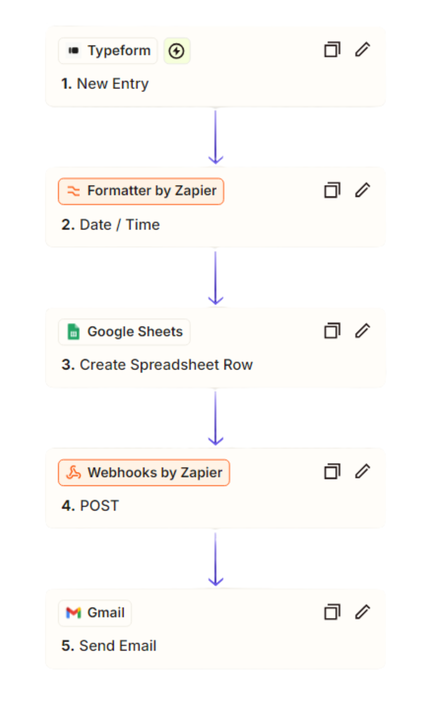

# DXSP01-Brand Survey Automation Project

## Overview 專案簡介

**本專案是一套以Zapier為觸發中介的品牌認知調查流程數位轉型專案，將定期數據收集、格式轉換、通知發送、數據搬遷與利用、再行銷行為完全自動化；落地後能進一步對接ELT/Data Mart數據架構，支援行銷團隊進行策略成效追蹤與定時/即時決策。專案成果不僅將業務流程自動化、最小化人工錯誤，也提供可迭代與可移植性的原型，更能做為小型數據需求測試，為後續資料基礎建設與數據驅動目標提供良好基礎。**


--- 

## Objectives 專案目標

- 降低行銷團隊人工處理問卷與分析時間成本
- 設計任務與資料流的運行邏輯
- 根據商業應用需求將數據收集機制標準化
- 設計即時/定期KPI儀表板，提升決策效率
- 導入dbt作為數據轉換與建模工具，促進跨部門數據協作
---


## Technical Stack 工具技術

| 工具 | 用途 |
|------|------|
| **API** | Webhook Integration, OAuth 2.0 授權, GCP API 認證, Service Account Key |
| **Typeform** | 問卷收集 |
| **Zapier** | 自動觸發資料流程與第三方軟體整合 |
| **Google Sheets** | 問卷暫存與查閱 |
| **Python** | 問卷資料清洗與貼標 |
| **Airbyte** | 資料同步/Extract工具 |
| **BigQuery** | 雲端資料儲存與查詢 |
| **dbt** | 資料建模與轉換(SQL-Based) |
| **Looker Studio** | BI工具 |
| **Notion** | 專案進度與分析紀錄 |
| **Gmail** | 自動發信 |
---

## Folder Structure 資料結構

```text
📁 dxsp01_brand_survey_automation
├── 📁 dbt
│   ├── 📄 dbt_project.yml
│   ├── 📄 Dockerfile
│   ├── 📁 logs
│   │   └── 📄 dbt.log
│   ├── 📁 models
│   │   ├── 📁 intermediate
│   │   │   ├── 📄 int_brand_survey_cleaned.sql
│   │   │   └── 📄 int_brand_survey_cleaned.yml
│   │   ├── 📁 mart
│   │   ├── 📁 staging
│   │   │   ├── 📄 bq_sources.yml
│   │   │   └── 📄 stg_brand_survey.sql
│   │   └── 📁 test
│   │       └── 📄 test_model.sql
│   ├── 📄 profiles.yml
├── 📄 docker-compose.yml
├── 📁 docs
│   ├── 📄 airbyte_connection_setup.md
│   ├── 📄 API.md
│   ├── 📄 docker_airbyte_deployment.md
│   ├── 📄 file_system_diagram.ipynb
│   ├── 📄 zapier_trigger_airbyte.md
│   └── 📄 zapier_worflow_setup.md
├── 📄 README.md
```

## Zapier Workflow Diagram 工作流程圖



```text
[Typeform]       New Entry 收集問卷資料 →
[Formatter by Zapier]      格式化日期欄位 →
[Google Sheets]  建立新列並寫入資料 →
[Webhook by Zapier]        POST 觸發Airbyte(connection prepared in Port 8000 )資料同步 →
[Gmail]          自動發送通知信件
```
---

## Environment Setup Guide 環境配置指南

略，請參考docs/.md各個環境與設定指南
---

## Project Highlights 專案成果

- [x] 累積品牌市調專案資料，支援各式品牌曝光ROI評估，加速行銷策略的迭代
- [x] 降低行銷團隊手動作業錯誤率至接近0%
- [x] 每日品牌市調數據處理時效由人工2小時縮短至0分鐘
- [x] 採Cloud-based DW、SQL-based Transformation與數據分層的數據治理架構，在轉型初期即建立良好的彈性、易維護性與近用性
---

## Follow-up Optimization 後續優化 

- 整合進完整的資料管線(由Airflow排程)
- 數據隱私管理(如Webhooks改採使用環境變數或Zapier Secret作為token儲存)
---

## 👤 Author Maintainer 

- **Rex C.**
- **chanminglung126@gmail.com**
- [**Profile**](https://github.com/Rexgogo/dxsp01_brand_survey_automation.git)
- [**GitHub**](https://github.com/Rexgogo/dxsp01_brand_survey_automation.git)
- **Skills:**
  - Python/SQL
  - ETL (Airflow)
  - Data extract (Airbyte)
  - Data Modeling & Transformation (dbt, BigQuery)
  - Cloud Data Warehouse (BigQuery)
  - BI Dashboarding (Superset, Looker Studio)
  - Automation tool (Zapier)

--- 